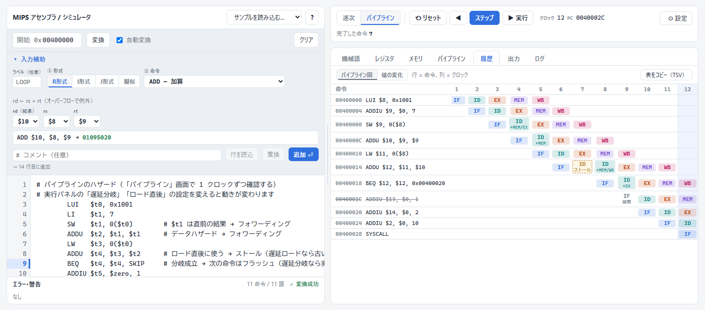
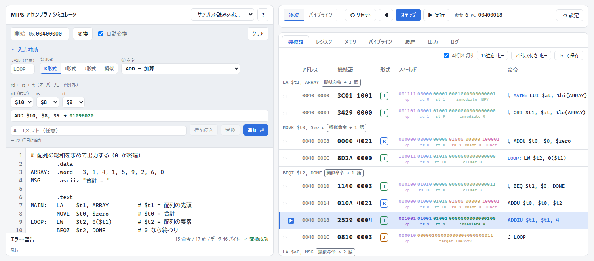

# MIPS Assembler / Simulator

English | [日本語](README.md)

[](https://github.com/quwon-000/MIPS-pipeline-simulator/actions/workflows/test.yml)
[](LICENSE)

A MIPS assembler and simulator that runs entirely in the browser. It translates assembly into machine code (hex) and lets you step through both single-cycle execution and a 5-stage pipeline, clock by clock.

**Demo: https://quwon-000.github.io/MIPS-pipeline-simulator/**

> The user interface is in Japanese. Instruction names, registers, hex values and the pipeline diagram (IF / ID / EX / MEM / WB) are language-independent.



## Features

- **No installation**: a single HTML file with no external libraries.
- **Assembler**
  - 54 MIPS I integer instructions (MIPS32 encoding) and MARS / SPIM compatible pseudo-instructions (`LI`, `LA`, `MOVE`, `BLT`, ...)
  - Directives such as `.data`, `.word` and `.asciiz`, and memory access by label (`LW $t0, ARRAY+4`)
  - Bit-field view of every instruction (op / rs / rt / ...) and error messages with line numbers
  - An input helper for picking instructions and registers from drop-down lists
- **Simulator**
  - Single-cycle execution and a 5-stage pipeline (IF / ID / EX / MEM / WB)
  - Forwarding, load-use stalls and flushing on taken branches
  - Optional delayed branches and delayed loads (MIPS I behaviour)
  - Arithmetic overflow exceptions, `SYSCALL` (output / exit) and `BREAK`
- **Visualization and debugging**
  - Pipeline diagram (instructions × clock cycles, showing stalls, flushed instructions and forwarding sources)
  - Pipeline register values (`IF/ID.PC`, `ID/EX.A`, `EX/MEM.ALUOut`, ...)
  - Breakpoints, stepping backwards, and editing registers / memory during execution



## Usage

1. Open the [demo](https://quwon-000.github.io/MIPS-pipeline-simulator/) (or open `index.html` in a browser).
2. Write assembly in the editor on the left (sample programs are available from the drop-down at the top).
3. Press "ステップ" (Step, F10) to run one instruction / one clock, or "▶ 実行" (Run, F9) to run to the end.

```asm
        .data
ARRAY:  .word   3, 1, 4, 1, 5
MSG:    .asciiz "Sum = "
        .text
MAIN:   LA      $a0, MSG
        LI      $v0, 4
        SYSCALL                 # print string
        LW      $t0, ARRAY+4    # $t0 = 1
```

## Supported instructions

| Kind | Instructions |
|---|---|
| Arithmetic / logic | `ADD` `ADDU` `SUB` `SUBU` `AND` `OR` `XOR` `NOR` `SLT` `SLTU` `ADDI` `ADDIU` `SLTI` `SLTIU` `ANDI` `ORI` `XORI` `LUI` |
| Shift | `SLL` `SRL` `SRA` `SLLV` `SRLV` `SRAV` |
| Multiply / divide | `MULT` `MULTU` `DIV` `DIVU` `MFHI` `MFLO` `MTHI` `MTLO` |
| Memory | `LW` `LH` `LHU` `LB` `LBU` `SW` `SH` `SB` |
| Branch / jump | `BEQ` `BNE` `BLEZ` `BGTZ` `BLTZ` `BGEZ` `BLTZAL` `BGEZAL` `J` `JAL` `JR` `JALR` |
| Other | `SYSCALL` `BREAK` |
| Pseudo | `NOP` `LI` `LA` `MOVE` `NOT` `NEG` `NEGU` `MUL` `DIV` (3 operands) `B` `BEQZ` `BNEZ` `BLT` `BGE` `BGT` `BLE` `BLTU` `BGEU` `BGTU` `BLEU` |
| Directives | `.text` `.data` `.word` `.half` `.byte` `.ascii` `.asciiz` `.space` `.align` `.globl` |

`SYSCALL` supports `$v0` = 1 (print integer), 4 (print string), 10 (exit), 11 (print character), 17 (exit with code) and 34 (print hex).

## Pipeline design

| Item | Behaviour |
|---|---|
| Branch resolution | ID stage |
| Forwarding | From EX, MEM and WB to ID (newest result wins) |
| Load-use hazard | 1-cycle stall (or MIPS I delayed load, configurable) |
| Taken branch | Flush the already-fetched instruction (or delayed branch, configurable) |
| Exceptions / exit | Older instructions complete, younger instructions are discarded |

## Tests

```sh
npm test    # or: node test/assembler.test.js (Node.js 18+, no dependencies)
```

The tests extract the assembler and simulator scripts from `index.html` and run 244 checks:

- **Encoding**: machine code of every instruction matches the MIPS32 specification
- **Round trip**: 3,000 random instructions are assembled, disassembled and re-assembled to the same word
- **Reference model**: 300 random programs are compared against an independent, straightforward implementation of the instruction semantics
- **Single-cycle vs. pipeline**: the same programs produce identical registers and memory in both modes (three configurations)
- **Pipeline timing**: pipeline register values at each clock and the position of stalls and flushes

Use `SEED=1 npm test` to change the random seed.

## Project structure

```
index.html                 The application (assembler, simulator and UI)
test/assembler.test.js     Tests
images/                    Images for the README
```

## Not supported

- Floating-point instructions (coprocessor 1) and exception handlers (execution stops on an exception)
- Input `SYSCALL`s (5, 8, 12, ...)

## License

[MIT](LICENSE)
