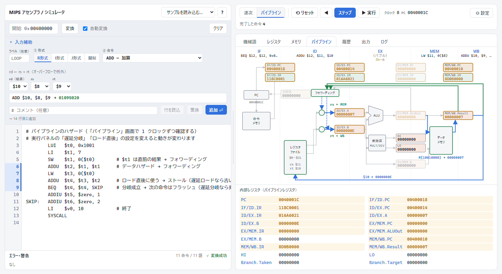

# MIPS アセンブラ / シミュレータ

[English](README.en.md) | 日本語

[](https://github.com/quwon-000/MIPS-pipeline-simulator/actions/workflows/test.yml)
[](LICENSE)

ブラウザだけで動く MIPS のアセンブラ / シミュレータです。計算機アーキテクチャ（特にパイプライン処理）を学ぶことを目的としており、アセンブリを機械語（16 進）に変換して、命令が逐次実行と 5 段パイプラインをどう流れるかをクロックごとに確認できます。

**デモ: https://quwon-000.github.io/MIPS-pipeline-simulator/**


## 目的と対象

パイプラインのハザードやフォワーディングは、教科書の図だけでは動きを追いにくい部分です。このツールは、命令が 1 クロックごとにどう進み、どの値がどこへ渡されるかを、図と表で確認できるようにすることを目指しています。

- **対象**：計算機アーキテクチャを学ぶ学生や、それを教える人
- **重視していること**：動きの見やすさ、1 ステップずつ進めたり戻したりできること、テストで確かめた正確さ
- **目的としていないこと**：実際のプロセッサのタイミングを正確に再現すること、大きなプログラムを高速に実行すること

## 特徴

- **インストール不要**：HTML 1 ファイルで完結し、外部ライブラリも使っていません。
- **アセンブラ**
  - MIPS I の整数命令 54 種（MIPS32 のエンコーディング）と、MARS / SPIM 互換の擬似命令（`LI` `LA` `MOVE` `BLT` など）
  - `.data` `.word` `.asciiz` などのディレクティブと、ラベルを使ったメモリアクセス（`LW $t0, ARRAY+4`）
  - 命令ごとのビットフィールド（op / rs / rt / …）の表示、行番号付きのエラーメッセージ
  - 命令とレジスタをプルダウンで選んで入力できる「入力補助」
- **シミュレータ**
  - 逐次実行と、IF / ID / EX / MEM / WB の 5 段パイプライン
  - フォワーディング、ロード直後の依存のストール、分岐成立時のフラッシュ
  - 遅延分岐・遅延ロード（MIPS I の動作）への切り替え
  - 算術オーバーフロー例外、`SYSCALL`（出力・終了）、`BREAK`
- **可視化とデバッグ**
  - パイプライン図（命令 × クロック。ストール・破棄・フォワーディング元を表示）
  - 値の変化の表：初期値と各クロックの値を並べる。行（パイプラインレジスタ・汎用レジスタ・メモリの番地）と表示するクロック数を選べ、列を「観測点の命令を通るたび（1回目・2回目…）」にしてループの各周回を比べることもできる。TSV でコピー可能
  - パイプラインの内部構造図（データパス図）：ステージ境界のパイプラインレジスタ（`IF/ID.PC` `ID/EX.A` `EX/MEM.ALUOut` …）の値と、フォワーディング・分岐・メモリの読み書き・書き戻しの経路をクロックごとに表示
  - ブレークポイント、1 ステップずつ戻る、実行途中でのレジスタ・メモリの書き換え




## 使い方

1. [デモ](https://quwon-000.github.io/MIPS-pipeline-simulator/) を開く（または `index.html` をブラウザで開く）。
2. 左のエディタにアセンブリを書く（エディタ上部の「サンプルを読み込む…」で例を読み込めます）。
3. 「ステップ」（F10）で 1 命令 / 1 クロックずつ、「▶ 実行」（F9）で最後まで実行します。

```asm
        .data
ARRAY:  .word   3, 1, 4, 1, 5
MSG:    .asciiz "合計 = "
        .text
MAIN:   LA      $a0, MSG
        LI      $v0, 4
        SYSCALL                 # 文字列を出力
        LW      $t0, ARRAY+4    # $t0 = 1
```

詳しい書き方は、エディタ上部の「?」（ヘルプ）にまとめています。

## 対応している命令

| 種類 | 命令 |
|---|---|
| 演算 | `ADD` `ADDU` `SUB` `SUBU` `AND` `OR` `XOR` `NOR` `SLT` `SLTU` `ADDI` `ADDIU` `SLTI` `SLTIU` `ANDI` `ORI` `XORI` `LUI` |
| シフト | `SLL` `SRL` `SRA` `SLLV` `SRLV` `SRAV` |
| 乗除算 | `MULT` `MULTU` `DIV` `DIVU` `MFHI` `MFLO` `MTHI` `MTLO` |
| メモリ | `LW` `LH` `LHU` `LB` `LBU` `SW` `SH` `SB` |
| 分岐・ジャンプ | `BEQ` `BNE` `BLEZ` `BGTZ` `BLTZ` `BGEZ` `BLTZAL` `BGEZAL` `J` `JAL` `JR` `JALR` |
| その他 | `SYSCALL` `BREAK` |
| 擬似命令 | `NOP` `LI` `LA` `MOVE` `NOT` `NEG` `NEGU` `MUL` `DIV`（3 オペランド） `B` `BEQZ` `BNEZ` `BLT` `BGE` `BGT` `BLE` `BLTU` `BGEU` `BGTU` `BLEU` |
| ディレクティブ | `.text` `.data` `.word` `.half` `.byte` `.ascii` `.asciiz` `.space` `.align` `.globl` |

`SYSCALL` は `$v0` = 1（整数出力）、4（文字列出力）、10（終了）、11（文字出力）、17（終了コード付き終了）、34（16 進出力）に対応しています。

## パイプラインの設計

| 項目 | 動作 |
|---|---|
| 分岐の判定 | ID ステージ |
| フォワーディング | EX・MEM・WB の結果を ID へ（優先順位は新しい順） |
| ロード直後の依存 | 1 クロックストール（設定で MIPS I の遅延ロードに変更可） |
| 分岐成立時 | フェッチ済みの 1 命令をフラッシュ（設定で遅延分岐に変更可） |
| 例外・終了 | 先行する命令は完了させ、後続の命令は捨てる |

### 教科書の標準的な 5 段パイプラインとの違い

パイプラインレジスタの名前は教科書（Patterson & Hennessy『コンピュータの構成と設計』）の表記にそろえていますが、フォワーディングの方式など、細かい動きは教科書の標準的な設計と異なります。

| 項目 | このツール | 教科書の標準的な設計 |
|---|---|---|
| フォワーディング先 | **ID ステージ**（EX・MEM・WB の結果を ID で受け取り、`ID/EX.A`・`ID/EX.B` には受け取った後の値が入る） | EX ステージの入口（EX/MEM・MEM/WB から ALU の入力へ） |
| 直前の演算結果で分岐 | **ストールなし** | 1 クロックストール（分岐を ID で判定する版） |
| 直前のロード結果で分岐 | **1 クロック**ストール | 2 クロックストール |
| ロード直後の演算 | 1 クロックストール | 1 クロックストール（同じ） |
| MEM/WB | 書き戻す値を 1 つ（`MEM/WB.Result`）にまとめる | 読み出したデータと ALU の結果を別々に持つ |
| 例外 | その場で停止する | EPC に番地を保存して、例外処理ルーチンへ飛ぶ |

ID でフォワーディングを受けると、EX の結果を同じクロックのうちに分岐の比較へ使えるので、分岐のストールが減ります。その代わり、実際の回路では 1 クロックの間に通る経路（ALU → 選択 → 比較）が長くなり、動作周波数を上げにくくなる、というトレードオフがあります。構造図では、読みやすさのために即値・符号拡張の経路と制御信号を省略しています。

## テスト

```sh
npm test    # または node test/assembler.test.js（Node.js 18 以上、依存パッケージなし）
```

`index.html` からアセンブラとシミュレータのスクリプトを取り出して検証します（244 項目）。

- **エンコーディング**：命令ごとの機械語が MIPS32 の仕様どおりか
- **往復テスト**：ランダムな 3000 命令を「アセンブル → 逆アセンブル → 再アセンブル」して同じ機械語になるか
- **参照実装との比較**：命令の意味を素直に書いた別実装と、ランダムな 300 本のプログラムで結果を比べる
- **逐次とパイプラインの一致**：同じプログラムを両方で実行し、レジスタ・メモリが一致するか（実行方式の 3 通りの組み合わせ）
- **パイプラインのタイミング**：各クロックのパイプラインレジスタの値、ストール・フラッシュの位置

乱数の種は `SEED=1 npm test` のように変えられます。

## ファイル構成

```
index.html                 アプリ本体（アセンブラ・シミュレータ・UI）
test/assembler.test.js     テスト
images/                    README 用の画像
```

## 対応していないもの

学習に必要な範囲に絞っているため、次のものには対応していません。

- 浮動小数点命令（コプロセッサ 1）、例外ハンドラ（例外が起きると停止します）
- 入力を受け取る `SYSCALL`（5・8・12 など）

## ライセンス

[MIT](LICENSE)
